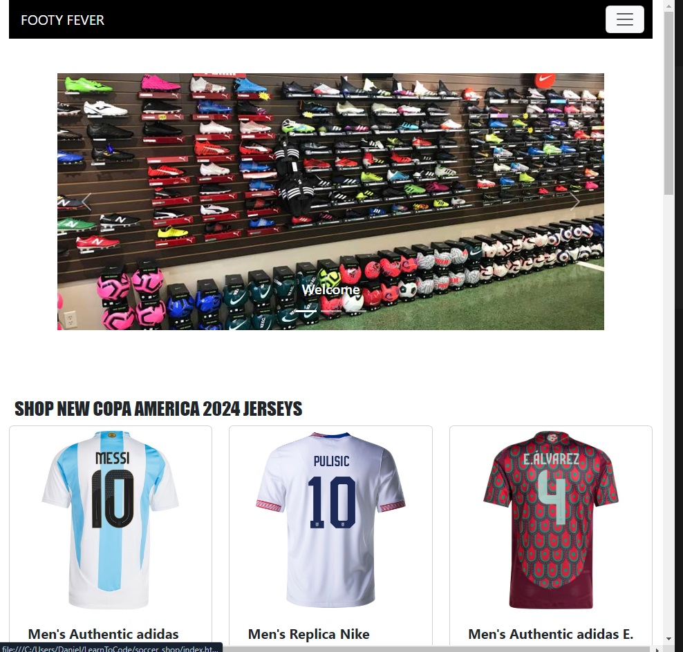
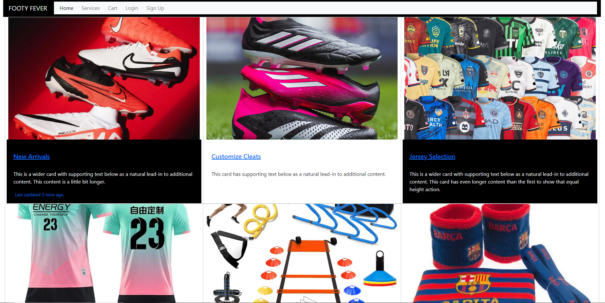
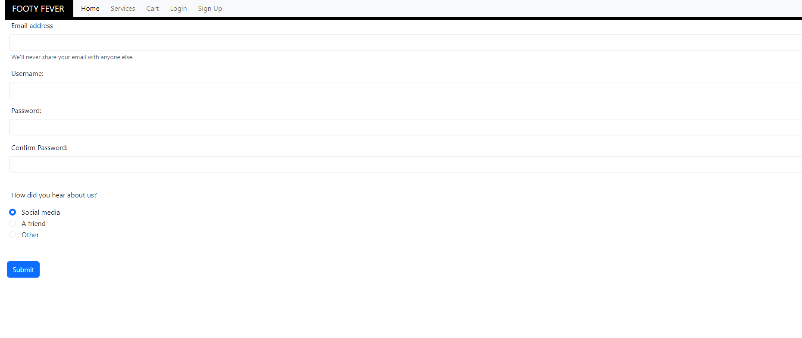
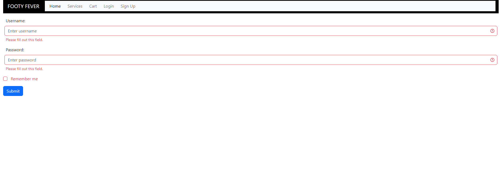
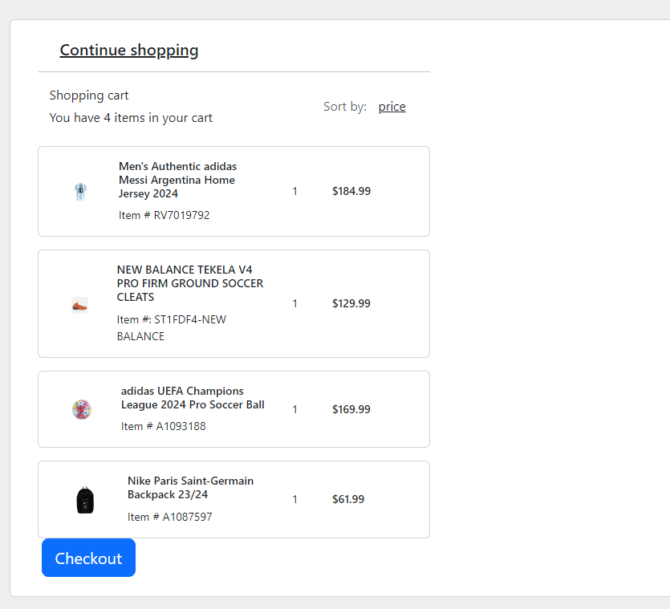
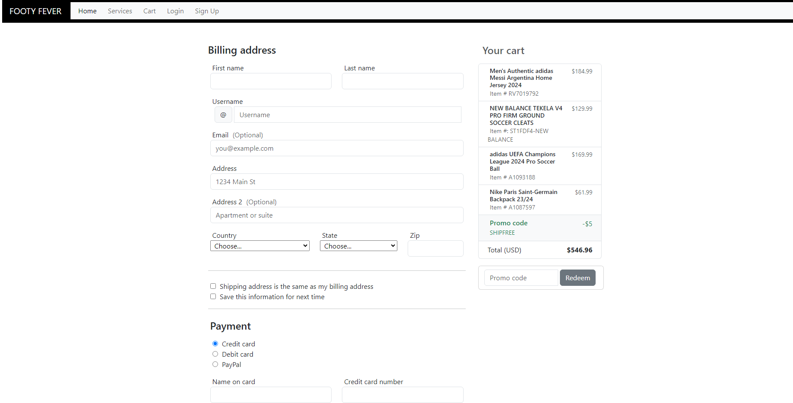

# soccer_shop

<h1>About the page</h1>
Welcome to the newest haven for soccer enthusiasts! We are thrilled to announce the grand opening of our soccer shop, where passion meets performance, and every kick ignites the spirit of the beautiful game. Nestled in the heart of [location], our store is a vibrant hub for players, fans, and aficionados alike, offering a curated selection of top-quality gear, apparel, and equipment to elevate your soccer experience. Whether you're a seasoned pro or just kicking off your journey, our knowledgeable staff is here to assist you in finding the perfect fit for your game. Step into our world of soccer and let the excitement begin!
<ul>
<li>Home Page</li>
<li>Services Page</li>
<li>Sign up Page</li>
<li>Login Page</li>
<li>Cart Page</li>
<li>Checkout Page</li>
</ul>

<h1>Coding languages used</h1>
<ul>
<li>HTML</li>
<li>CSS</li>
<li>Bootstrap</li>
 

 
<h1>Installation</h1>
<ul>
<li>Clone the repository https://github.com/danny-h10/soccer_shop.git</li>
<li>Navigate to the directory- cd soccer_shop</li>
</ul>